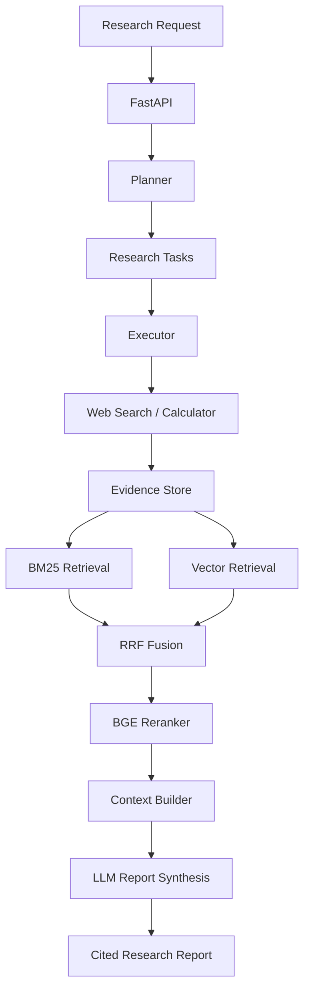

# Enterprise Research Agent
[](https://github.com/VictoryTing/Enterprise-Research-Agent/actions/workflows/tests.yml)

An evidence-grounded enterprise research agent that plans complex research tasks, collects web evidence, retrieves relevant information, executes research subtasks, and produces structured reports with traceable sources.

## Key Features

- Planner–Executor agent workflow
- Asynchronous research execution through FastAPI
- Multi-step LLM tool calling
- Brave Search and Tavily Search adapters
- Calculator tool
- Tool timeout, retry, and error handling
- Structured evidence storage and URL deduplication
- Hybrid retrieval using BM25 and embedding-based vector search
- Reciprocal Rank Fusion (RRF)
- Optional BGE cross-encoder reranking
- Automatic fallback to RRF when reranking fails
- Evidence-grounded context construction
- Structured report generation with citations
- Per-run tracing and execution logs
- Offline retrieval evaluation and report comparison

## System Architecture



When the BGE reranker is disabled or fails, the pipeline uses the original RRF ranking.

## Research Workflow

1. A user submits a research question through `POST /research`.
2. The planner decomposes the question into executable subtasks.
3. The executor asks the LLM to select and call available tools.
4. Search results are normalized and stored as structured evidence.
5. The retriever combines BM25 and vector rankings through RRF.
6. The optional BGE reranker refines the candidate order.
7. The context builder selects relevant evidence within the configured limit.
8. The LLM synthesizes a structured report from the retrieved evidence.
9. The user retrieves progress and the final report through `GET /runs/{run_id}`.

## API Endpoints

### `POST /research`

Starts an asynchronous research run and immediately returns a `run_id`.

Example request:

```json
{
  "query": "请比较 NVIDIA NIM 与 Triton 的定位、功能和适用场景，并给出信息来源。"
}
```

Example initial response:

```json
{
  "run_id": "example_run_id",
  "status": "pending"
}
```

### `GET /runs/{run_id}`

Returns the current run state, including:

- Research goal
- Planned tasks
- Task execution states
- Collected evidence
- Trace information
- Final report
- Error information

## Retrieval Pipeline

The retrieval pipeline contains four main stages:

1. **BM25 retrieval** ranks evidence by lexical relevance.
2. **Vector retrieval** ranks evidence by embedding similarity.
3. **RRF fusion** combines the two independent rankings.
4. **BGE reranking** optionally performs deeper query-document relevance scoring.

This design combines exact keyword matching with semantic retrieval while preserving a reliable fallback path.

## Search Reliability

The search execution layer distinguishes between different outcomes:

| Provider response | System behavior |
|---|---|
| Valid results | Continue execution |
| Valid empty result list | Ask the LLM to use a different, more focused query |
| Provider error | Retry automatically |
| Invalid response format | Retry automatically |
| Retry limit reached | Return a structured tool failure |

For comparison tasks, the executor instructs the LLM to search each product or entity separately and prioritize official documentation.

## Retrieval Evaluation

The retrieval pipeline was evaluated on a labelled synthetic dataset containing 13 candidate documents and 12 English and Chinese queries.

The dataset includes hard negatives such as:

- NVIDIA NIM versus Triton Inference Server
- NeMo Framework versus NeMo Guardrails
- NVIDIA Blackwell versus NVIDIA H100
- API Gateway versus Kubernetes

| Retrieval pipeline | Recall@1 | Recall@3 | Recall@5 | MRR | Avg latency | P50 | P95 |
|---|---:|---:|---:|---:|---:|---:|---:|
| BM25 + Vector + RRF | 0.833 | 1.000 | 1.000 | 0.903 | 306.35 ms | 306.20 ms | 336.86 ms |
| BM25 + Vector + RRF + BGE | 1.000 | 1.000 | 1.000 | 1.000 | 1704.88 ms | 1700.02 ms | 1859.32 ms |

On this evaluation set, the BGE reranker:

- Improved two relevant documents to rank 1
- Introduced no ranking regressions
- Increased Recall@1 from `0.833` to `1.000`
- Increased MRR from `0.903` to `1.000`
- Added CPU inference latency

These measurements come from a small synthetic dataset and separate local runs. They demonstrate pipeline behavior but should not be interpreted as production-scale performance.

### Run the evaluation

```powershell
python -m eval.run_retrieval_eval
```

Evaluation reports are saved as timestamped JSON files under:

```text
eval/results/
```

### Compare two evaluation reports

```powershell
python -m eval.compare_retrieval_reports `
  eval/results/retrieval_rrf_<timestamp>.json `
  eval/results/retrieval_bge_<timestamp>.json
```

## Run Locally

### 1. Create the environment file

Copy `.env.example` to `.env`.

Configure the LLM API key and at least one supported search provider:

```env
LLM_API_KEY=your_key
SEARCH_PROVIDER=brave
BRAVE_SEARCH_API_KEY=your_key
```

Alternatively:

```env
SEARCH_PROVIDER=tavily
TAVILY_API_KEY=your_key
```

Do not commit the `.env` file.

### 2. Install dependencies

```powershell
pip install -e ".[dev]"
```

### 3. Start the API

```powershell
python -m uvicorn app.main:app --reload
```

### 4. Open the application

Research workspace:

```text
http://127.0.0.1:8000/
```

Swagger API documentation:

```text
http://127.0.0.1:8000/docs
```

## Run Tests

Run the complete test suite:

```powershell
python -m pytest -q
```

Current result:

```text
31 passed
```

The tests cover retrieval, reranking, evaluation metrics, evidence handling, context construction, search adapters, tool compatibility, retry behavior, empty search results, and evaluation report persistence.

## Project Structure

```text
enterprise-research-agent/
├── app/
│   ├── agents/          # Research agent orchestration
│   ├── api/             # FastAPI routes and schemas
│   ├── core/            # Planner, executor, configuration and LLM client
│   ├── memory/          # Evidence storage
│   ├── observability/   # Logging, context and tracing
│   ├── rag/             # Chunking, retrieval, vector store and reranking
│   ├── security/        # Security-related components
│   ├── tools/           # Web search and calculator tools
│   └── main.py          # FastAPI application entry point
├── eval/
│   ├── retrieval_cases.json
│   ├── retrieval_metrics.py
│   ├── run_retrieval_eval.py
│   ├── compare_retrieval_reports.py
│   └── results/
├── scripts/
├── tests/
├── .env.example
├── pyproject.toml
└── README.md
```

## Observability

Each research run records spans for:

- Planning
- LLM task reasoning
- Tool execution
- Evidence retrieval
- Report synthesis
- End-to-end research execution

Retrieval logs include:

- BM25 score and rank
- Vector similarity score and rank
- RRF score
- BGE reranker score
- Final retrieval score

These logs make it possible to inspect why evidence was selected and identify slow or unsuccessful stages.

## Limitations

- Research runs and evidence are currently stored in memory.
- Restarting the application removes previous run data.
- Search adapters currently rely mainly on search-result snippets rather than complete webpage extraction.
- BGE reranking can introduce significant CPU latency.
- Search quality depends on the external provider and query formulation.
- Citation correctness is encouraged through prompting but is not yet enforced by a deterministic citation validator.
- The current benchmark is synthetic and relatively small.

## Future Improvements

- PostgreSQL persistence for research runs and evidence
- Redis-backed task state and caching
- Full webpage extraction and content cleaning
- Deterministic citation validation
- Source authority and freshness scoring
- Parallel research-task execution
- Larger multilingual evaluation datasets
- Docker deployment
- Authentication and rate limiting

## Technology Stack

- Python 3.10
- FastAPI
- Pydantic
- OpenAI-compatible LLM and embedding APIs
- BM25
- Vector similarity search
- Reciprocal Rank Fusion
- BGE Reranker
- Brave Search / Tavily Search
- asyncio
- pytest

## Project Status

The current version provides a complete research-agent MVP with:

- Planner–Executor orchestration
- Reliable tool execution
- Hybrid evidence retrieval
- Optional reranking and graceful fallback
- Evidence-grounded report generation
- Retrieval evaluation
- End-to-end API demonstration